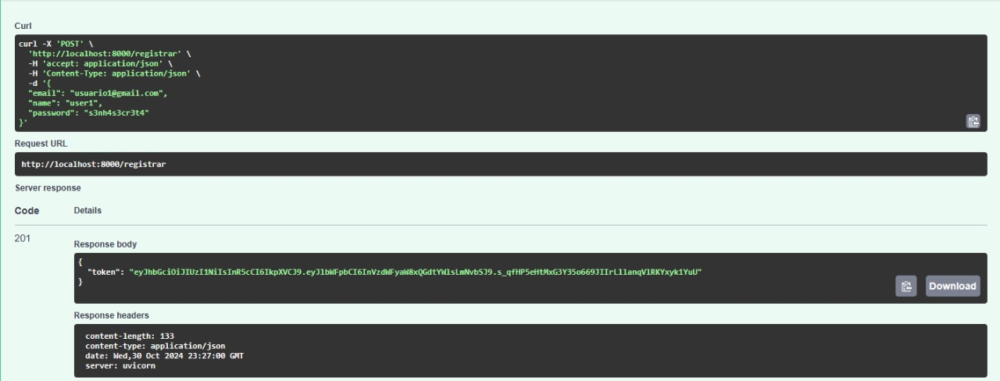
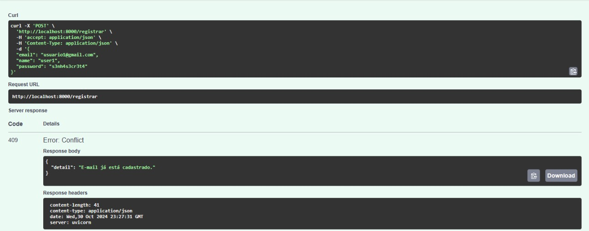
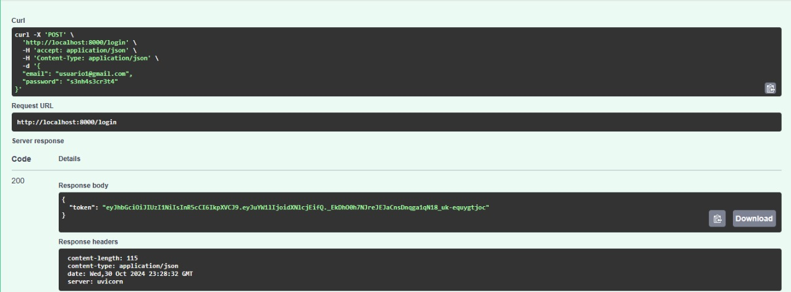
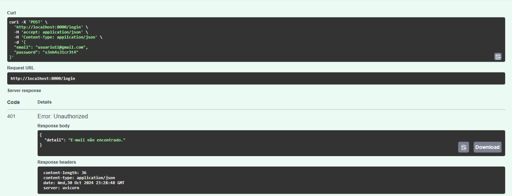
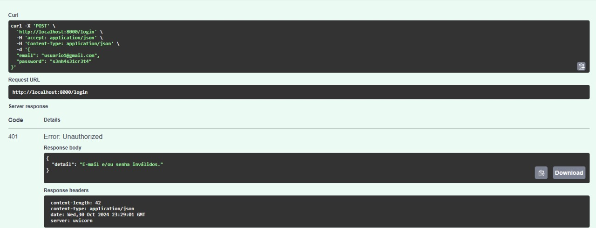
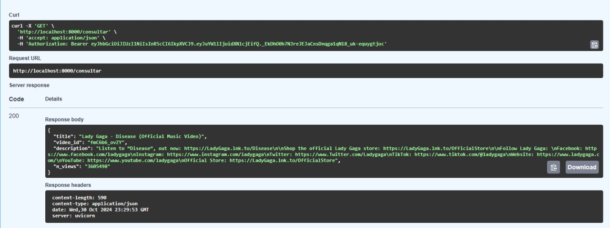
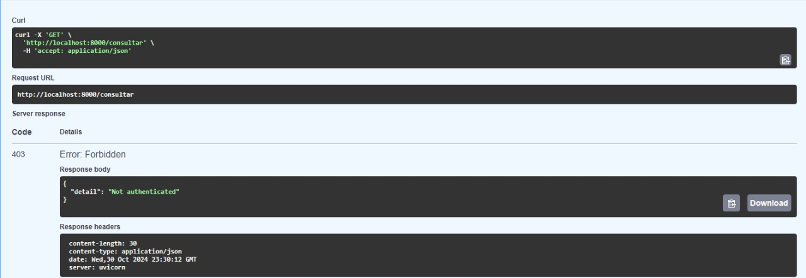
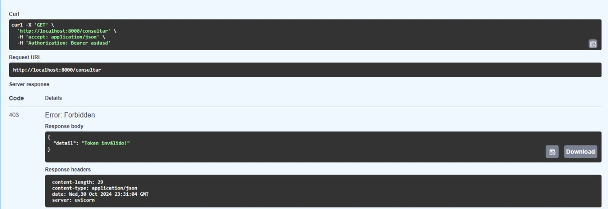

# Projeto

O seguinte projeto foi feito seguindo as diretrizes estabelecidas no [site da disciplina](https://insper.github.io/computacao-nuvem/): *Home* > *Projetos* > *Projeto 2024-2 (Rubrica)*

As pastas do projeto estão estruturadas da seguinte forma:

```
📁 api
└── 📁 app
    ├── 📄 __init__.py
    ├── 📄 main.py
    ├── 📄 models.py
    └── 📄 utils.py
├── 🐳 Dockerfile
└── 📄 requirements.txt
📁 documentation
└── 📁 docs
    └── 📄 index.md
└── 📄 mkdocs.yaml
📄 .gitignore
📄 .env
🐳 compose.yaml
```

Sendo que apenas a pasta `📁 api` é publicada como imagem no Docker Hub.

A pasta `📁 documentation` contém os arquivos gerados pelo comando `mkdocs new documentation` e não são usados na *dockerização*.

## Construção da API

Para a construção da API que trata as chamadas aos *endpoints* `/registrar`, `/login` e `/consultar` foi usado o *framework* FastAPI, que é baseado em outras bibliotecas como OpenAPI e Pydantic. A API se conecta com uma base de dados do PostgreSQL onde serão armazenados os dados do usuário que é registrado.

### Endpoints

As requisições podem ser feitas para 3 possíveis *endpoints*:

#### `POST /registrar`

Para essa requisição, deve ser enviado um *payload* contendo o nome do usuário (`"name"`), o e-mail (`"email"`) e a senha (`"password"`). A senha é codificada em um *hash*, utilizando o algoritmo **SHA-256**, para ser armazenada de forma segura na base de dados.

É retornado um ***token* JWT** que pode ser decodificado para um dicionário com nome do usuário e seu e-mail caso o usuário tenha sido criado com sucesso. Caso contrário, é levantado o erro `409 Conflict`, com a mensagem "E-mail já está cadastrado".

<figure markdown="span">
  
  <figcaption>Figura 1 - Registro bem sucedido</figcaption>
</figure>

<figure markdown="span">
  
  <figcaption>Figura 2 - Erro ao registrar</figcaption>
</figure>

#### `POST /login`

Deve ser enviado um *payload* contendo o e-mail e a senha. É verificado se o e-mail existe na base de dados, caso exista, uma segunda verificação é feita para as *hashs* das senhas. Caso o e-mail não seja encontrado, é retornado o erro `401 Unauthorized` com a mensagem "E-mail não encontrado". Caso a senha não corresponda à cadastrada para aquele e-mail, o mesmo erro é retornado com a mensagem "E-mail e/ou senha inválidos".

Em caso de sucesso, é retornado um ***token* JWT** que deve corresponder ao usuário que está realizando o *log-in*.

<figure markdown="span">
  
  <figcaption>Figura 3 - Log-in bem sucedido</figcaption>
</figure>

<figure markdown="span">
  
  <figcaption>Figura 4 - E-mail não encontrado</figcaption>
</figure>

<figure markdown="span">
  
  <figcaption>Figura 5 - Log-in não autorizado (e-mail ou senha incorretos)</figcaption>
</figure>

#### `GET /consultar`

É feita a autenticação utilizando um *Bearer Token*, sendo o *token* o mesmo que foi retornado pelo `POST` no *endpoint* `/login`. Quando o token não é fornecido ou é inválido, o erro `403 Forbidden` com a mensagem "Token inválido!" é retornado. Caso o método de autenticação esteja incorreto, ou seja, não seja *Bearer*, o mesmo erro é retornado com a mensagem "Método de autenticação inválido".

Em caso de sucesso, é retornado o conteúdo do *scraping*, no formato de um dicionário, dos vídeos **Em Alta** do *YouTube*.

<figure markdown="span">
  
  <figcaption>Figura 6 - Reautenticação bem sucedida</figcaption>
</figure>

<figure markdown="span">
  
  <figcaption>Figura 7 - Token não fornecido</figcaption>
</figure>

<figure markdown="span">
  
  <figcaption>Figura 8 - Token fornecido mas é inválido/incorreto</figcaption>
</figure>

### Scraping

Os dados a serem retornados pela última *endpoint* são retirados da API do YouTube¹ sendo que o funcionamento dos vídeos da sessão **Em Alta** atualizam a cada 15 minutos².

Para cada requisição do tipo `GET /consultar` é feita uma requisição para o endereço `https://www.googleapis.com/youtube/v3/videos`, na qual são passados parâmetros como o tipo de vídeo que desejamos selecionar (`"chart"`), região (`"regionCode"`) e número limite para seleção dos vídeos por requisição (`n`).

Os parâmetros são passados no formato de um dicionário com o seguinte conteúdo:

```py
params = {
    "part": "snippet,contentDetails,statistics", 
    "chart": "mostPopular",
    "regionCode": "BR", 
    "maxResults": n, 
    "key": api_key
}
```

O campo `"key"` é a chave da API, que será abordado na parte de [Execução](#executando-o-projeto).

## Docker

Para permitir o teste da API integrada ao banco de dados, foi feita a *dockerização* da aplicação, isto é, um arquivo `compose.yaml` foi criado para que a imagem da aplicação pudesse ser executada em qualquer computador, desde que exista uma outra imagem contendo um banco de dados PostgreSQL.

Toda informação referente ao modo de execução da aplicação está presente no arquivo `Dockerfile`.

Para fins de segurança, a porta do banco de dados não é exposta, ou seja, é apenas feita uma conexão entre a aplicação e o PostgreSQL através da criação de uma rede (`network`) com `driver: bridge`.

### Publicação da imagem no Docker Hub

A publicação do projeto foi feita pelo por linha de código, pelos comandos mostrados a seguir:

```bash
docker build -t carlosepy/projeto-cloud:tag ./api
docker push carlosepy/projeto-cloud:tag
```

Substituindo `tag` pela respectiva *tag* a ser publicada (por exemplo, `v1.0`).

Link para Docker Hub do projeto: [projeto-cloud](https://hub.docker.com/r/carlosepy/projeto-cloud)

## Executando o projeto

Primeiramente, crie uma pasta na qual o seu projeto será executado. Aqui, a chamaremos de `📁 projeto`.

Dentro dessa pasta, crie um arquivo `.env` seguindo o exemplo mostrado abaixo (no repositório, existe um arquivo `.env.example` contendo essas informações).

```py
DB_USERNAME="projeto"
DB_PASSWORD="projeto"
DB_NAME="projeto"
DB_HOST="db"
SECRET_KEY="your_secret_key"
KEY_API="your_api_key" # (1)
```

1. Essa variável deverá ser modificada para o funcionamento da API do YouTube.

Para todos os campos exceto `KEY_API`, vamos manter o valor padrão.

<div class="grid cards" markdown>

- :material-api:{ .lg .middle } __Como adquirir a chave da API__

    ---

    Gere sua própria chave (`KEY_API`) pelo [Google Cloud Console](https://console.cloud.google.com)

    [:octicons-arrow-right-24: Primeiros passos](yt_api.md)

</div>

!!! warning

    Faça o passo anterior antes de continuar para garantir que a instalação será feita de forma correta.

Com a chave em mãos e o arquivo `.env` pronto, crie um arquivo `compose.yaml` ou `docker-compose.yaml` com as imagens da aplicação e do banco de dados PostgreSQL (versão 17 para melhor funcionamento).

```yaml
services:
  api:
    image: carlosepy/projeto-cloud:tag # (1)
    networks:
      - app
    depends_on:
      - db
    environment:
      - DB_USERNAME=${DB_USERNAME:-projeto}
      - DB_PASSWORD=${DB_PASSWORD:-projeto}
      - DB_HOST=${DB_HOST:-db}
      - DB_NAME=${DB_NAME:-projeto}
      - SECRET_KEY=${SECRET_KEY:-secretkey}
      - KEY_API=${KEY_API:-your_api_key} # (2)
    ports:
      - "8000:8000"

  db:
    image: postgres:17
    networks:
      - app
    environment:
      POSTGRES_PASSWORD: ${DB_PASSWORD:-projeto}
      POSTGRES_USER: ${DB_USER:-projeto}
      POSTGRES_DB: ${DB_NAME:-projeto}

networks:
  app:
    driver: bridge
```

1. Troque `tag` pela versão da imagem na qual deseja trabalhar.
2. Substitua pela chave que você adquiriu anteriormente!

No fim, nosso diretório deveria seguir a seguinte estrutura:

```markdown
📁 projeto
├── 📄 .env
└── 🐳 compose.yaml
```

Dessa forma, podemos, finalmente, fazer o *build* das nossas imagens e subí-las através do comando:

```bash
docker compose up -d --build
```

!!! note

    Lembre-se de abrir o aplicativo do Docker antes de executar o `docker compose`!

## Publicação do projeto na AWS

Para publicar o projeto, utilizaremos o Kubernetes, que é uma ferramenta de orquestração de contêineres junto ao EKS (Elastic Kubernetes Service), que é um serviço gerenciado voltado à facilitar o uso de tal ferramenta com a AWS.

Foi criada uma infraestrutura de tal forma que as aplicações (API e banco de dados) estejam em um contexto isolado ao mundo externo, com apenas a porta da API para que seja feita a comunicação com outros serviços, tais como um possível *loadbalancer* caso exista necessidade de aumentar o número de réplicas da aplicação (escalabilidade).

Foi configurado o ambiente do EKS e criadas duas instâncias em EC2 (Elastic Compute Cloud), que é um serviço que disponibiliza ao usuário computadores virtuais para executar aplicações. As duas instâncias são a API e o banco de dados PostgreSQL.

Para isso, com o auxílio do CloudFormation, que é um serviço semelhante ao Terraform, foram criados dois arquivos `yaml`, um para cada serviço e foram aplicados ao serviço da AWS através do comando `kubectl apply -f <nome-do-arquivo>`. Os arquivos são mostrados abaixo:

=== "app-deployment.yaml"

    ``` yaml
    apiVersion: apps/v1
    kind: Deployment
    metadata:
      name: fastapi-deployment
    spec:
      replicas: 1
      selector:
        matchLabels:
          app: fastapi-app
      template:
        metadata:
          labels:
            app: fastapi-app
        spec:
          containers:
          - name: fastapi-container
            image: carlosepy/projeto-cloud:v1.4
            ports:
            - containerPort: 8000
            env:
            - name: DB_USERNAME
              value: "projeto"
            - name: DB_PASSWORD
              value: "projeto"
            - name: DB_HOST
              value: "db-service"
            - name: DB_NAME
              value: "projeto"
            - name: SECRET_KEY
              value: "secretkey" # valor que pode ser alterado para geração dos tokens JWT
            - name: KEY_API
              value: "suachave" # alterar para o valor obtido através do processo de obtenção da chave da API do Youtube v3
    ---
    apiVersion: v1
    kind: Service
    metadata:
      name: fastapi-service
    spec:
      selector:
        app: fastapi-app
      ports:
      - protocol: TCP
        port: 8000
        targetPort: 8000
      type: LoadBalancer
    ```

=== "db-deployment.yaml"

    ``` yaml
    apiVersion: apps/v1
    kind: Deployment
    metadata:
      name: db
    spec:
      replicas: 1
      selector:
        matchLabels:
          app: db
      template:
        metadata:
          labels:
            app: db
        spec:
          containers:
          - name: db
            image: postgres:17
            env:
            - name: POSTGRES_DB
              value: "projeto"
            - name: POSTGRES_USER
              value: "projeto"
            - name: POSTGRES_PASSWORD
              value: "projeto"
            ports:
            - containerPort: 5432
    ---
    apiVersion: v1
    kind: Service
    metadata:
      name: db-service
    spec:
      selector:
        app: db
      ports:
      - port: 5432
        targetPort: 5432
    ```

Para acessar o site que contém a aplicação, basta clicar acesse o README no [repositório](https://github.com/kadu-ymd/projeto-cloud) e clique em "**Link para a página da documentação da API**". O vídeo explicativo contendo a demonstração do que foi feito também está no link do GitHub anteriormente endereçado.

## Referências

1. [YouTube Data API v3](https://developers.google.com/youtube/v3?hl=pt-br)
2. [Ajuda do YouTube](https://support.google.com/youtube/?hl=pt-BR&sjid=17857485006955206207-SA#topic=9257498) > Central de Ajuda > Assistir vídeos >  Encontrar vídeos para assistir > Encontrar vídeos para assistir > [Em Alta no YouTube](https://support.google.com/youtube/answer/7239739?hl=pt-BR#:~:text=Em%20alguns%20países%2C%20os%20Shorts,na%20mesma%20posição%20na%20lista.)
3. [Como criar um cluster Kubernetes na AWS com EKS](https://www.youtube.com/live/JrT5YV1KMeY?si=dr6A7FnBwGGAUUAN)