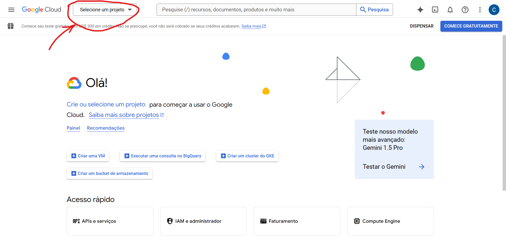
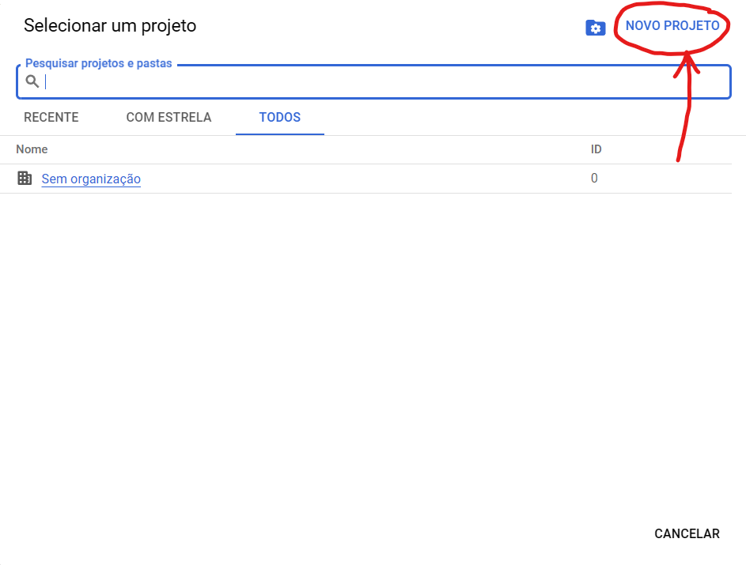
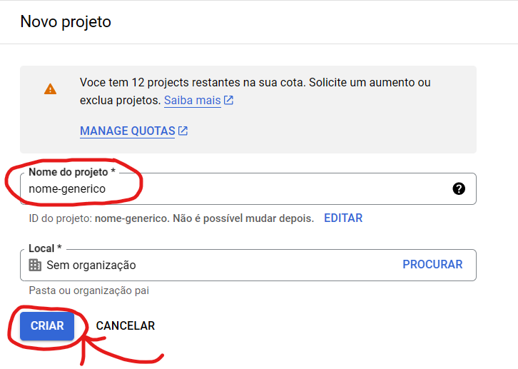
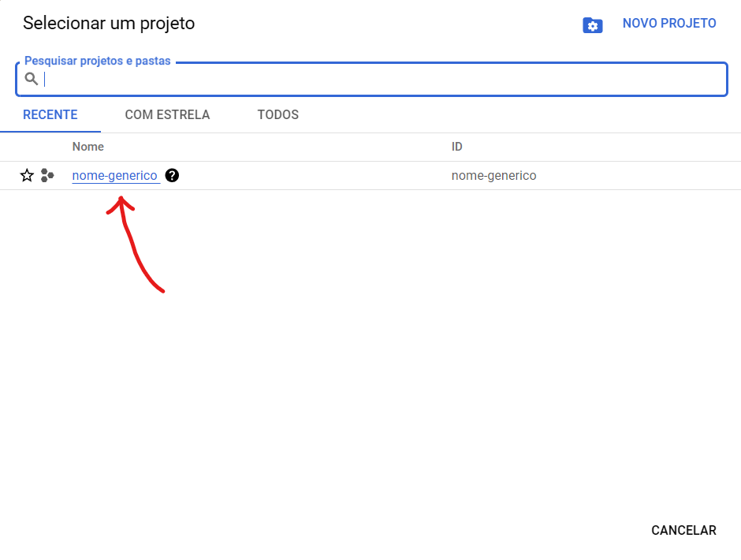
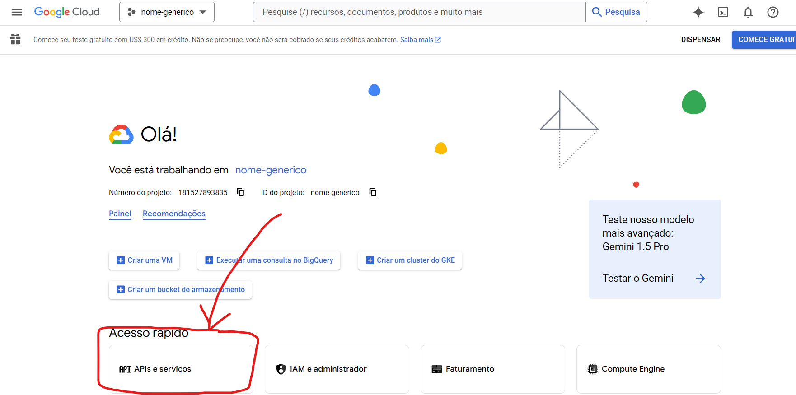
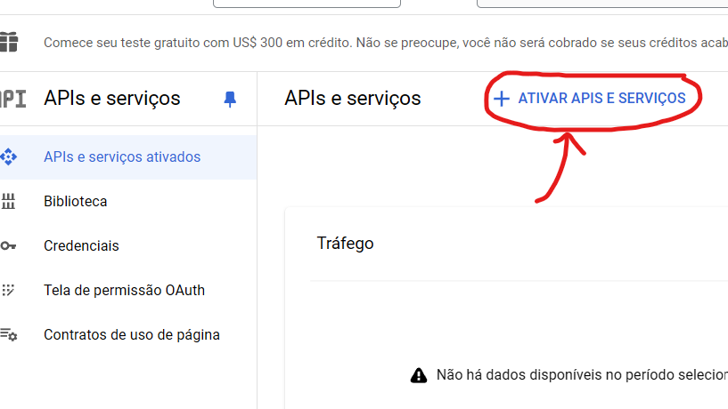
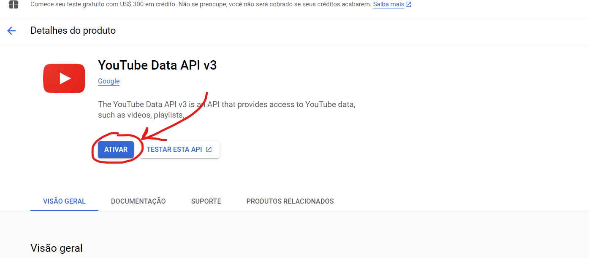
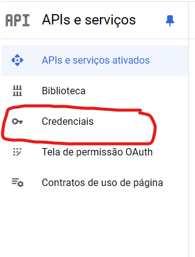
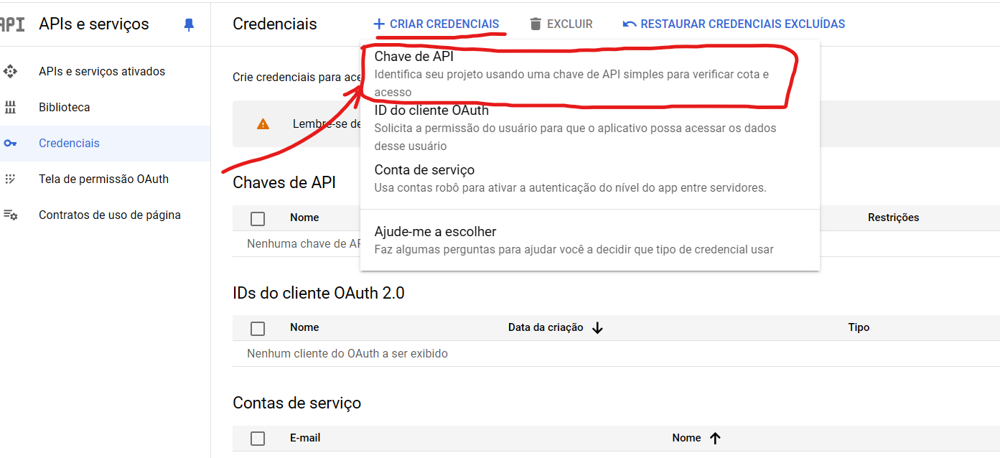

# YouTube API v3 - Chave da API

## Primeiros passos

Acesse o [Google Cloud Console](https://console.cloud.google.com) e faça login, se já não o fez.

### Passo 1

Clique em **Selecione um projeto** na caixa de seleção, no canto **superior esquerdo** da página.

### Passo 2

Uma janela abrirá com os seus projetos. Clique em **Novo Projeto** para criar um projeto.

### Passo 3

Atribua um nome ao seu projeto. Chamamos aqui de "nome-generico" para fins práticos. Em seguida, clique em **Criar**.

### Passo 4

Uma notificação aparecerá no canto superior direito da sua tela indicando que o projeto está sendo criado. Após finalizar o processo, clique em **Selecionar Projeto** na notificação ou repita o passo 1, porém, dessa vez, selecionando o projeto que foi criado.

### Passo 5

Com o projeto selecionado, acesse a aba de **APIs e Serviços** pelo menu de *Acesso Rápido* ou pelo menu hambúrguer no canto superior esquerdo da tela.

### Passo 6

Em seguida, clique em **Ativar APIs e Serviços** e pesquise por "YouTube Data API v3".

### Passo 7

Ative o serviço "YouTube Data API v3".

### Passo 8

Clique na aba Credenciais no menu esquerdo.

### Passo 9

Clique em **Criar credenciais** > **Chave de API**

Pronto! Agora copie e cole sua chave no arquivo `.env` (no campo `KEY_API`) e siga a documentação a partir de onde parou.